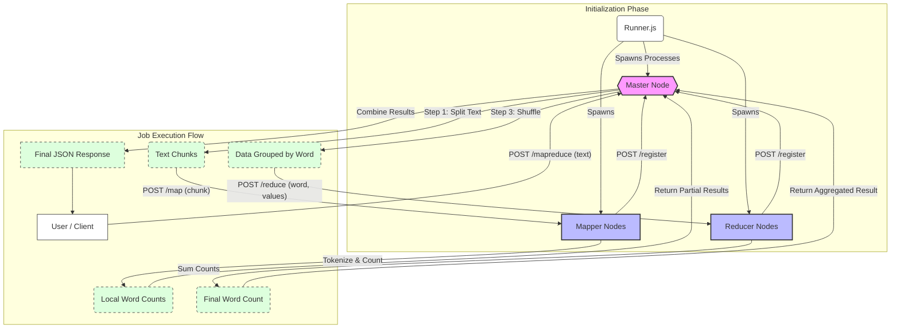

# Distributed MapReduce Demo

A mini distributed MapReduce system built using Node.js.  
It includes a **Master Node**, **Mapper Workers**, and **Reducer Workers** communicating over REST APIs to process text for word counting.

---

## 🔴 Repo Available
If you wish to directly get the project in you local, you can clone this repo here:

```
https://github.com/er-abhijeet/final-proj.git
```


## 📌 Architecture (Quick Overview)

- `master.js`: Splits input text → sends chunks to registered mappers → shuffles results → distributes keys to reducers → aggregates final counts.
- `mapper.js`: Counts words in assigned text chunks.
- `reducer.js`: Aggregates counts for each word across mappers.
- `runner.js`: Automatically launches Master + 2 Mappers + 2 Reducers in separate terminals.

---

## 📦 Dependencies

Install required packages:
🤞 You need to have node js and npm installed on your device!

```
npm install
```
This installs:
express
axios
cors

## ▶️ Run Instructions

😪  I've made a runner file which opens all the terminals for you just run this command!!
### 1️⃣Run ALL Automatically (Recommended)
```
node runner.js
```

### 2️⃣ Or maybe you prefer running each service manually (Separate Terminals)
| Service   | Command                                      |
| --------- | -------------------------------------------- |
| Master    | `node master.js 3000`                        |
| Mapper 1  | `node mapper.js 3001 http://localhost:3000`  |
| Mapper 2  | `node mapper.js 3002 http://localhost:3000`  |
| Reducer 1 | `node reducer.js 4001 http://localhost:3000` |
| Reducer 2 | `node reducer.js 4002 http://localhost:3000` |


## Next Step: 
Verify workers registered:
```
curl http://localhost:3000/workers
```

Run MapReduce job:
```
curl -X POST "http://localhost:3000/mapreduce" ^
  -H "Content-Type: application/json" ^
  -d "{\"text\":\"hello world hello distributed systems world\"}"
```
### Note:
🔴This works if you have curl installed and you run this command in cmd (not in powershell)
If not, you can use postman using the following params:
POST request in the url:
```
http://localhost:3000/mapreduce
```

with body:
```
{
    "text" : "hello world hello distributed systems world"
}
```

## 🛑 Stopping Services
Press Ctrl + C inside each worker terminal (auto un-registers them).



